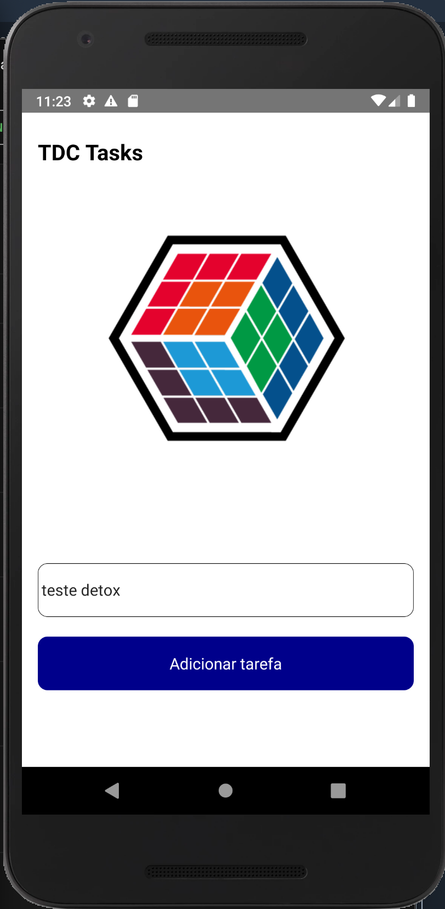
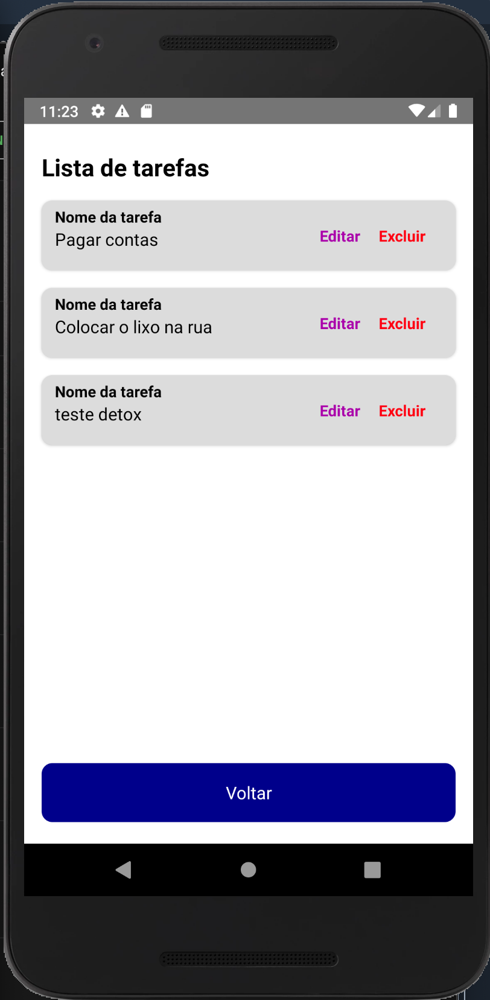

<div align="center">
  
  
</div>  

## :computer: O Projeto

Task APP - APP feito exclusivamente para exibir o funcionamento do framework **Detox**
em projetos em React Native

## :pushpin: Tecnologias

Esse projeto foi desenvolvido com as seguintes tecnologias:

- [React Native](https://reactnative.dev/)
- [Detox Framework](https://github.com/wix/Detox)


## :point_down: Executando o projeto

No seu terminal copie e cole ou digite o comando abaixo:

```git
git clone https://github.com/Bug-In-Prod/tasks_app.git  
````


Após realizar o clone acesse a pasta do projeto:

```git
cd tasks_app
````

Logo em seguida digite o comando __*yarn*__ para baixar e atualizar as dependências do projeto

_OBS_: Se for rodar o projeto no iOS também, execute o comando:

```terminal
cd ios && pod install cd ..
````
  
Para executar o projeto digite em seu terminal o comando:

Para Android
```terminal
yarn android
````

Para iOS
```terminal
yarn ios
````
  
## :fire: Executando os Testes

Exitem 4 scripts criados dentro do **package.json** para ajudar na execução dos testes  


Para Android

```terminal
yarn build-android
````

Logo após já é possível rodar o comando:

```terminal
yarn test-android
````
  
Para iOS

```terminal
yarn build-ios
````

Logo após já é possível rodar o comando:

```terminal
yarn test-ios
````

---
Feito com coração, café e muito esforço :heart: :rocket: